## Data structures and algorithms - s

### 一、时间复杂度

定性的描述程序运行所需要的时间（定性，性质，非准确时间），用大 O 表示


如上图所示，O(1) 为最小时间，O(n!) 为最大时间

以下示例帮忙理解：

- `O(1)` 只运行一次


- `O(n)` 运行 n 次，取决于 n 的大小


- `O(1) + O(n) = O(n)` n 足够大，那么 1 就可以忽略不计


- `O(n) * O(n) = O(n^2)` 这个很好理解吧，就是平方


- `O(logN)` logN 就是求 2 的多少次方为 n


### 二、空间复杂度

描述程序运行过程中占用存储空间大小的量度，也是用大 O 表示

以下示例帮忙理解：

- `O(1)` 只有一个或多个固定数目的变量


- `O(n)` 数组中有 n 个内存单元


- `O(n^2)` n^2 个内存单元


### 三、数据结构

1. 栈
   - 后进先出的数据结构，js 中没有栈，但可以使用 Array 实现栈的所有功能
   - 什么场景使用栈？
     - 十进制转二进制
       - 
       - 代码：[十进制转二进制.js](./src/数据结构/栈/十进制转二进制.js)
     - 有效的括号
       - 
       - 代码：[有效括号.js](./src/数据结构/栈/有效括号.js)
       - 来源：[leetcode 20](https://leetcode.cn/problems/valid-parentheses/description/)
     - 函数调用堆栈
       - 
       - 这个可以去看我之前的文章[《深入 js 执行上下文》](https://juejin.cn/post/7206998548343373884)


2. 队列
    - 先进先出的数据结构，js 中没有队列，同样也可以使用 Array 实现队列的所有功能
    - 什么场景使用队列？
      - 食堂排队打饭
      - js 运行的异步队列
      - 最近的请求次数
        - 在某一时刻发起请求，并以当前时刻为基准，统计前 3000ms 一共发送了多少个请求，也就是说要返回一个数字。详细题目请看：[leetcode 933](https://leetcode.cn/problems/number-of-recent-calls/description/) ，当然，题目说的未必有我的清楚
        - 代码：[请求次数.js](./src/数据结构/队列/请求次数.js)


3. 链表
    - 多个元素组成的列表，元素存储不连续，用 next 指针连在一起，在 js 中可以使用 Object 来模拟链表
    - 
    - 数组和链表有啥区别？
      - 数组：连续的存储结构，增删非首尾元素时，往往需要移动元素
      - 链表：增删非首尾元素不需要移动元素，只需要更改 next 的指向即可
    - 链表数据结构模拟：[模拟链表.js](./src/数据结构/链表/模拟链表.js)
    - 做几道题：
      - 删除链表中的节点：
        - 来源：[leetcode 237](https://leetcode.cn/problems/delete-node-in-a-linked-list/description/)
        - 代码：[删除节点.js](./src/数据结构/链表/删除节点.js)
        - 思路：删除下一个节点
      - 反转链表：
        - 来源：[leetcode 206](https://leetcode.cn/problems/reverse-linked-list/)
        - 代码：[反转链表.js](./src/数据结构/链表/反转链表.js)
        - 思路：使用双指针遍历
      - 两数想加：
        - 来源：[leetcode 2](https://leetcode.cn/problems/add-two-numbers/)
        - 代码：[两数想加.js](./src/数据结构/链表/两数想加.js)
        - 思路：常规加法，注意进位问题
      - 排序链表去重：
        - 来源：[leetcode 83](https://leetcode.cn/problems/remove-duplicates-from-sorted-list/description/)
        - 代码：[排序链表去重.js](./src/数据结构/链表/排序链表去重.js)
        - 思路：遍历去重
      - 判断环形链表：
        - 来源：[leetcode 141](https://leetcode.cn/problems/linked-list-cycle/)
        - 代码：[判断环形链表.js](./src/数据结构/链表/判断环形链表.js)
        - 思路：操场上跑的快的肯定会追上跑得慢的
      - 实现 `instanceOf` 方法：
        - 来源：js 原型链的原理
        - 代码：[myInstanceOf.js](./src/数据结构/链表/myInstanceOf.js)
        - 思路：顺着 A 的 `__proto__` 找，如果和 B.prototype 相等，即为 true
      - 获取 json 节点：
        - 来源：重写获取不定层级值函数
        - 代码：[根据路径获取json节点.js](./src/数据结构/链表/根据路径获取json节点.js)
        - 思路：利用类似链表遍历的结构
        - 关联代码：[生成所有json节点对应路径.js](./src/数据结构/树/生成所有json节点对应路径.js)
      - 判断回文链表：
        - 来源：[leetcode 234](https://leetcode.cn/problems/palindrome-linked-list/)
        - 代码：[判断回文链表.js](./src/数据结构/链表/判断回文链表.js)
        - 思路：第一想法是转数组对比，但是这种方法太耗时耗内存了，所以改为对链表截断后遍历对比。使用数组的时空复杂度都是 `O(n)`，使用截断遍历对比后的时间复杂度是 `O(n)`，空间复杂度是 `O(1)`，事实上，虽然时间复杂度相同，但实际运行时间也大大缩减了


4. 集合
    - 一种<span style="color: orange">无序且唯一</span>的数据结构，ES6 中有集合，就是 Set
    - 做几道题：
      - 数组交集去重：
        - 来源：[leetcode 349](https://leetcode.cn/problems/intersection-of-two-arrays/description/)
        - 代码：`return [...new Set(nums1)].filter((n) => nums2.includes(n))`
        - 思路：经典的没话说，需要注意的一点是：对数组先去重再筛选，比先筛选再去重的运行速度要快一些（因为省去了对重复值的筛选）
        - 时间复杂度(TC)：O(mn)，m 是 nums1 的长度，是 filter 的时间，n 是 nums2 的长度，是调用 includes 方法的时间
        - 空间复杂度(SC)：O(m)，m 是 nums1 扩展出的数组长度


5. 字典
    - 以<span style="color: orange">键值对</span>的形式存储<span style="color: orange">唯一值</span>的数据结构，ES6 中的字典，就是 Map
    - 做几道题：
      - 数组交集去重（与上面 Set 是同一道题）：
        - 来源：[leetcode 349](https://leetcode.cn/problems/intersection-of-two-arrays/description/)
        - 代码：[数组交集去重.js](./src/数据结构/字典/数组交集去重.js)
        - 思路：使用 Map 去重一个数组后，遍历另一个数组找相同值，找到后把值从 Map 内删除。使用这种方法对比使用 Set 方法的好处是：时间复杂度从 O(mn) 降到了 O(n)，因为不需要 includes 去做筛选了
      - 有效括号（对之前使用栈解的优化）：
        - 来源：[leetcode 20](https://leetcode.cn/problems/valid-parentheses/description/)
        - 代码：[有效括号.js](./src/数据结构/字典/有效括号.js)
        - 思路：对括号使用映射关系
        - Plus：如果有需要用到这个方法，优先使用这个版本
      - 两数之和：
        - 来源：[leetcode 1](https://leetcode.cn/problems/two-sum/description/)
        - 代码：[两数之和.js](./src/数据结构/字典/两数之和.js)
        - 思路：婚姻介绍所的套路，有的话直接牵手走人，没有就先登记
      - 无重复字符的最长子串长度：
        - 来源：[leetcode 3](https://leetcode.cn/problems/longest-substring-without-repeating-characters/description/)
        - 代码：[最长子串长度.js](./src/数据结构/字典/最长子串长度.js)
        - 思路：双指针构建滑动窗口，右指针右移，遇重复就左指针右移到左边的重复字符的下一位，无重复则左指针不动，更新窗口中字符串的长度（和前长度相比取最大），而后继续右指针右移，循环往复，最后返回长度
      - 最小覆盖子串：
        - 来源：[leetcode 76](https://leetcode.cn/problems/minimum-window-substring/description/)
        - 代码：[最小覆盖子串.js](./src/数据结构/字典/最小覆盖子串.js)
        - 思路：双指针构建滑动窗口，右指针不断右移，直到窗口中包含了目标字符串的所有字符，开始左指针右移（尽量缩小窗口的长度），一直右移到窗口中不包含目标字符串的所有字符为止，再次右指针右移，循环往复，每次左指针右移之前，记录下窗口中的字符串，最后移动完成，找到长度最短的那个字符串


6. 树
    - 一种分层数据的抽象模型。js 中的没有树这个数据结构，但是树型结构很多，像 dom 树、json 树、fiber 树等等
    - <span style="color: orange">深度优先</span>遍历和<span style="color: orange">广度优先</span>遍历
      - 代码：[树的遍历.js](./src/数据结构/树/树的遍历.js)
      - 思路：
        - 深度优先：其实就是一般的遍历思维，for 循环，递归，按顺序找到值，比广度优先要简单
          <br/>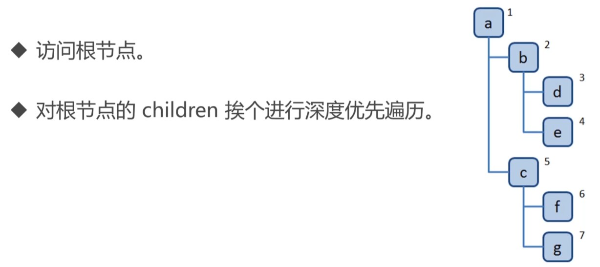
        - 广度优先：相对深度优先复杂一点，要利用队列的特性，一个一个的放进去，然后先进先出
          <br/>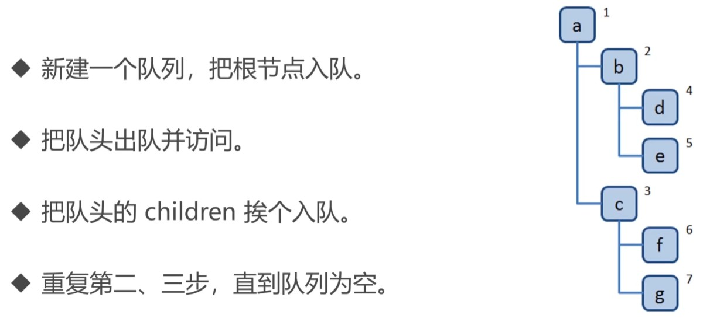
    - 二叉树
      - 定义：树中每个节点最多只能有两个子节点（可能有一个子节点，也可能没有子节点）
      - 二叉树的先、中、后序遍历
        - 代码：[二叉树的先中后序遍历.js](./src/数据结构/树/二叉树的先中后序遍历.js)
        - 思路：使用递归，递归进去的每一个元素都是一个子根，子根也是根，所以每次递归打印出根的值，也就涵盖了所有的值
          - 先序遍历，根-左-右
            <br/>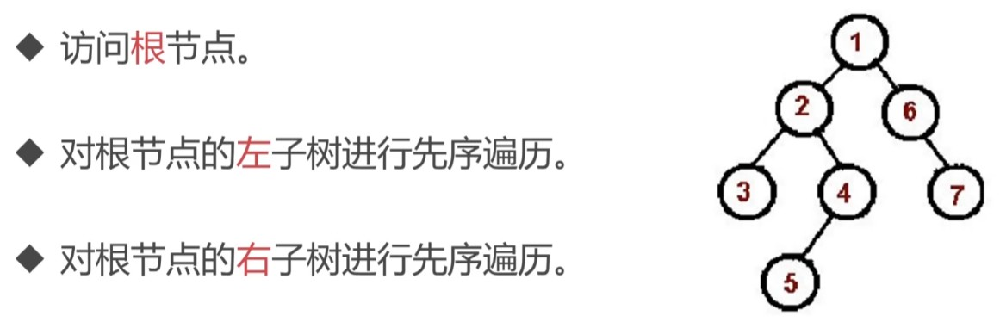
          - 中序遍历，左-根-右
            <br/>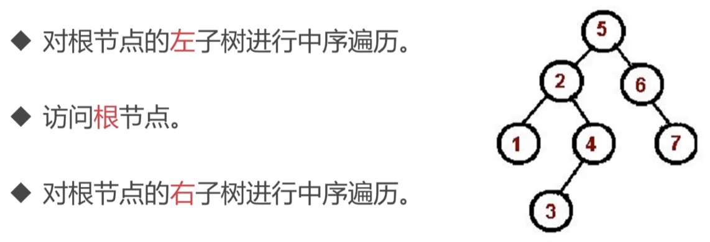
          - 后序遍历，左-右-根
            <br/>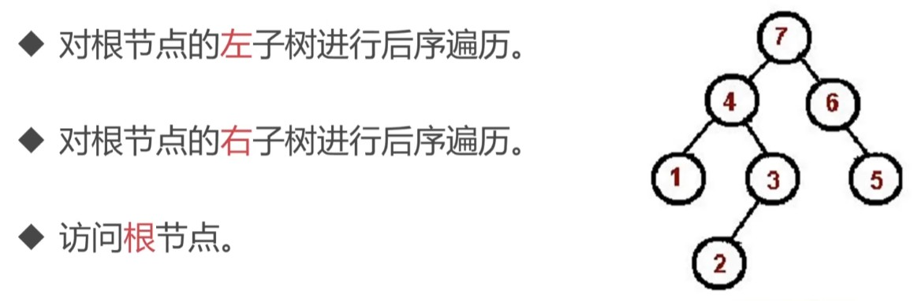
        - Plus：
          - 可以看到这个先、中、后三个字，指的就是`根`字的顺序（也就是遍历根节点的顺序）
          - 二叉树的`深度优先遍历`等同于`先序遍历`
          - 二叉树的`广度优先遍历`和普通树的广度优先遍历思路一样，可以把 left 和 right 看作 children 下的两个元素，手动加进队列即可
      - 二叉树的先、中、后序遍历（非递归版）
        - 代码：[二叉树的先中后序遍历_非递归.js](./src/数据结构/树/二叉树的先中后序遍历_非递归.js)
        - 思路：递归的执行原理就是堆栈，我们可以模拟堆栈实现
        - Plus：
          - 只要会了先、中、后序遍历，其它所有顺序遍历都是类似解法
          - 只要把实现二叉树的`广度优先遍历`的`队列`换成`栈`，`广度优先`就会变成`深度优先`
    - 做几道题：
      - 二叉树的最大深度：
        - 来源：[leetcode 104](https://leetcode.cn/problems/maximum-depth-of-binary-tree/description/)
        - 代码：[二叉树最大深度.js](./src/数据结构/树/二叉树最大深度.js)
        - 思路：深度优先遍历的时候带上层级
      - 二叉树的最小深度：
        - 来源：[leetcode 111](https://leetcode.cn/problems/minimum-depth-of-binary-tree/description/)
        - 代码：[二叉树最小深度.js](./src/数据结构/树/二叉树最小深度.js)
        - 思路：可以使用深度优先遍历带层级解决，但是深度优先需要遍历完所有节点才能得到最小深度，而使用广度优先遍历，由于是一层一层的遍历，只要遇到了叶子节点，那必定就是最小深度了
      - 二叉树的层序遍历：
          - 描述：就是把相同层级的节点放在一起（按层归类）
          - 来源：[leetcode 102](https://leetcode.cn/problems/binary-tree-level-order-traversal/description/)
          - 代码：[二叉树层序遍历.js](./src/数据结构/树/二叉树层序遍历.js)
          - 思路：以下两种解法，经测试没有优劣之分，看情况使用
            - 解法-1：广度优先遍历带层级，相同层级的元素，把值放在同一个数组内
            - 解法-2：广度优先遍历，给相同层级的元素计数，当相同层级的元素全部遍历出队后，再遍历下一层级的元素
      - 二叉树的中序遍历：
        - 来源：[leetcode 94](https://leetcode.cn/problems/binary-tree-inorder-traversal/description/)
        - 代码：[二叉树中序遍历.js](./src/数据结构/树/二叉树中序遍历.js)
        - 思路：就是二叉树的中序遍历，分为递归版和非递归版，这题最终用的是非递归版，经有限测试，非递归版本似乎比递归版本的运行速度要快
      - 路径之和：
        - 来源：[leetcode 112](https://coding.imooc.com/lesson/446.html#mid=36885)
        - 代码：[路径之和.js](./src/数据结构/树/路径之和.js)
        - 思路：深度优先，遍历时计算出节点的和，并在递归时传给下一层节点。由于二叉树的深度优先等同于先序遍历，所以用先序遍历非递归实现也可以，但是经过测试，发现先序遍历非递归运行速度更慢，所以最终这题还是使用深度优先遍历解决
      - 遍历 json 的所有节点并生成路径：
        - 来源：前端，可能会用到类似方法，推荐使用生成数据不包含 json 本身的（主要是包含本身没有意义，还多占用了一份空间，当然特殊情况除外）
        - 代码：[生成所有json节点对应路径.js](./src/数据结构/树/生成所有json节点对应路径.js)
        - 思路：其实就是递归，和深度优先类似
        - 关联代码：[根据路径获取json节点.js](./src/数据结构/链表/根据路径获取json节点.js)
      - 渲染树组件：
        - 来源：前端业务可能会出现
        - 代码：[codesandbox - 深度优先渲染树列表](https://codesandbox.io/p/sandbox/shen-du-you-xian-xuan-ran-shu-lie-biao-hr2njp?file=%2Fsrc%2FApp.js%3A62%2C1)
        - 思路：没啥好说的，就是递归


7. 图
    - 图是<span style="color: orange">网状结构</span>的抽象模型，是一组由<span style="color: orange">边</span>连接的<span style="color: orange">节点</span>，图可以表示任何<span style="color: orange">二元</span>关系。在 js 中是肯定没有图这个概念的，但是老规矩，可以用 Object、Array 模拟
    - 图的表示法有：邻接矩阵、邻接表、关联矩阵。。。，下面是邻接矩阵和邻接表示意图
      <br/>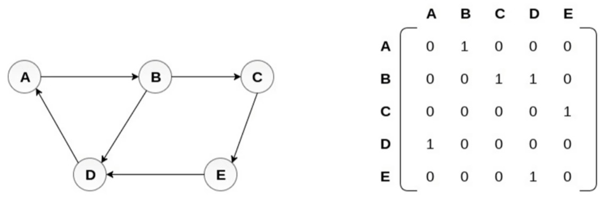
      <br/>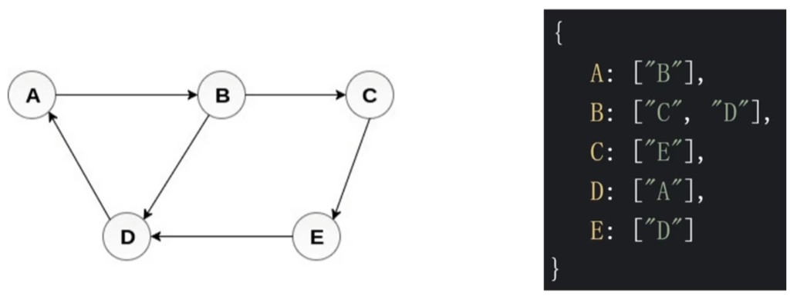
    - 图的深度和广度优先遍历
      - 深度优先：尽可能深的搜索图的分支
        <br/>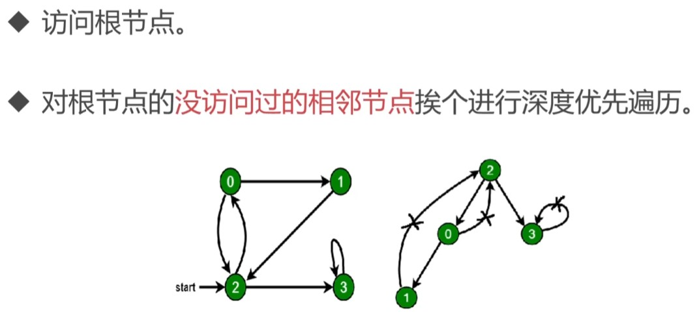
      - 广度优先：先访问离根节点最近的节点
        <br/>
      - 思路：图的遍历与树的遍历类似，图与树的不同就在于：树是逐层向下的，没有回路，而图可能存在回路，所以关键就在于遍历的时候不要对节点重复访问即可
      - 代码：[图的遍历.js](./src/数据结构/图/图的遍历.js)
    - 做几道题
      - 有效的数字
        - 来源：[leetcode 65](https://leetcode.cn/problems/valid-number/)
        - 代码：[有效数字.js](./src/数据结构/图/有效数字.js)
        - 思路：主要就是构建一个图，然后遍历字符一步步的走，走不通直接不通过，走到最后，如果是状态 3、5、6 就通过，其它状态不通过。如下图所示，一开始都是状态 0，之后开始遍历字符，根据字符类型，走到下一个状态，如果走不通，返回 false，如果走得通就一直遍历到结束，看最终状态是否是 3、5、6 即可
          <br/>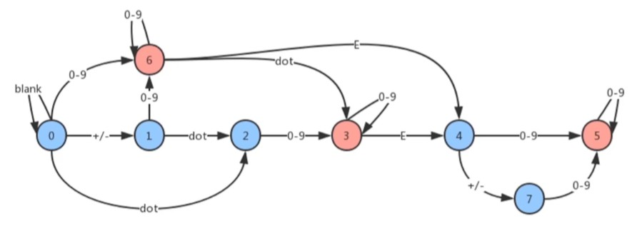
      - 太平洋大西洋水流问题
        - 来源：[leetcode 417](https://leetcode.cn/problems/pacific-atlantic-water-flow/)
        - 代码：[水流问题.js](./src/数据结构/图/水流问题.js)
        - 思路：如果位置一个个的判断的话是比较繁琐，我们使用逆向思维，把太平洋和大西洋的水分别逆流，然后取它们可逆流所到位置的交集。然后在代码实现上，通过一个位置导向其它位置主要是利用图的指向性和深度优先解决
      - 图的克隆
        - 来源：[leetcode 133](https://leetcode.cn/problems/clone-graph/description/)
        - 代码：[克隆图.js](./src/数据结构/图/克隆图.js)
        - 思路：先把深度优先或广度优先代码写出来，然后在上面做修改


8. 堆
    - 堆是一种特殊的完全二叉树
      - 完全二叉树：所有节点都被填满，如果没有填满，只缺少最右边的若干叶子节点
      - 所有的节点都大于等于（最大堆）或小于等于（最小堆）它的子节点
      - 个人感觉：在各种和排序相关的场景下都可以使用堆，它的时间复杂度`O(logN)`比主流排序算法的时间复杂度`O(n*logN)`要简单
    - 在 js 中通常用数组表示堆
      <br/>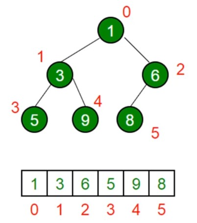
    - 左侧子节点的位置：`2 * index + 1`
    - 右侧子节点的位置：`2 * index + 2`
    - 父节点的位置（只取商）：`(index - 1) / 2`
    - 第 K 个最大元素问题（元素大小排名从大到小第 K 大）
      - 这个需要知道最小堆类的实现，才能理解下面所说的含义
        <br/>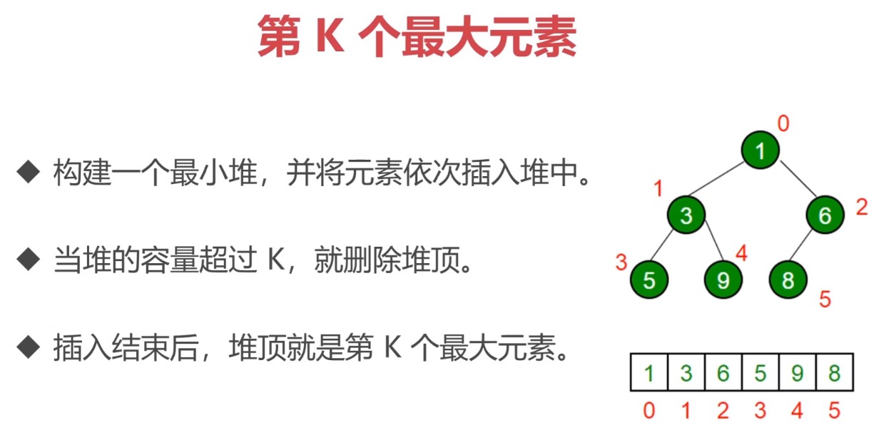
    - 做几道题
      - 实现最小堆类
        - 来源：没啥来源，就是用 js 实现一个最小堆的类
        - 代码：[最小堆类.js](./src/数据结构/堆/最小堆类.js)
        - 思路：使用数组实现堆类，包含 insert、pop、peek、size 等方法
      - 数组中第 K 个最大元素（从大到小排名第 K 的元素）
        - 来源：[leetcode 215](https://leetcode.cn/problems/kth-largest-element-in-an-array/description/)
        - 代码：[第K大元素.js](./src/数据结构/堆/第K大元素.js)
        - 思路：使用最小堆类操作，当长度大于 K 时，执行 pop 操作。时间复杂度为 `O(n * logK)`，这道题在 leetcode 上对于长度特别长的测试用例会超出时间限制，但还是姑且写在这里，重要的是利用堆的解题思路
      - 前 K 个高频元素（排名前 K 的高频出现的元素）
        - 来源：[leetcode 347](https://leetcode.cn/problems/top-k-frequent-elements/description/)
        - 代码：[前K个高频元素.js](./src/数据结构/堆/前K个高频元素.js)
        - 思路：使用最小堆类，思路和上一道题一样，只不过在代码上要对数据做些变换。时间复杂度为 `O(n * logK)`，幸运的是，这道题并没有超出时间限制
      - 合并 K 个排序链表
        - 来源：[leetcode 23](https://leetcode.cn/problems/merge-k-sorted-lists/description/)
        - 代码：[合并K个排序链表.js](./src/数据结构/堆/合并K个排序链表.js)
        - 思路：因为是排序后的链表，所以新链表的下一个节点肯定是 K 个链表中某个链表的头节点，把这些头节点放到最小堆中，头节点（堆中最小的）出去后，其所在链表的下一个节点又会成为新的头节点，不断的比较 K 个链表的头节点的大小，直到全部出去后，按照出去的顺序就构成了新的排序链表


### 四、搜索排序（特供）

因为这个对于前端来说比较重要，所以单独抽出一章来讲

排序：把某个乱序的数组变成升序或降序的数组
- 数组的 sort 方法

搜索：找出数组中某个元素的下标
- 数组的 indexOf 方法

#### 1、排序算法

- [排序图示链接](https://visualgo.net/zh/sorting)
- 说明：以下排序算法及描述均以升序排列作为目标
- 时间复杂度:
  - `O(n^2)`：冒泡、选择、插入，几乎没啥实用价值，其中插入排序相对好些
  - `O(n*logN)`：归并、快速，都有实用价值，个人更喜欢快速排序

1. 冒泡排序
    > 冒泡：最大的泡泡肯定飘在最上面，也就是数组的最后一位
    - 原理：
      - 比较所有的相邻元素，如果第一个比第二个大，则交换它们
      - 一轮下来，可以保证最后一个数是最大的，就像冒泡一样
      - 执行 `n - 1` 轮，就可以完成排序
    - 代码：[冒泡排序.js](./src/搜索排序/排序/冒泡排序.js)
      - 时间复杂度：`O(n^2)`
      - 外层循环：
        - 执行 `n - 1` 轮（执行 `n - 1` 轮后，第一个肯定是最小的，不需要再进行比较了）
      - 内层循环：
        - 执行 `n - 1 - i` 轮，`i` 代表的是外层轮次，首先因为是左和右比，最后一个元素右边没有了，所以不需要比，所以 `- 1`，然后，外层比了 `i` 轮，那么最右边的这 `i` 个就是最大的，也没有必要再比了，所以 `- i`
    - 评价：在所有排序中，性能表现并不好，一般不使用


2. 选择排序
    > 选择：意思就是选择某索引处的最小值
    - 原理：
      - 找到数组中最小的值，放在数组第一位
      - 继续找数组中最小的值，放在数组第二位
      - 以此类推，执行 `n - 1` 轮后完成排序
    - 代码：[选择排序.js](./src/搜索排序/排序/选择排序.js)
      - 时间复杂度：`O(n^2)`
      - 外层循环：
        - 执行 `n - 1` 轮（执行 `n - 1` 轮后，最后一个肯定是最大的，不需要再进行比较了）
      - 内层循环：
        - 索引要从 `i + 1` 开始，`i` 代表的是外层轮次，因为当前元素索引是 `i`，前面的 `i` 个元素已经是最小的，不需要比，应该从它的下一个元素开始比，所以索引是 `i + 1`
      - 和冒泡排序异同点：
        - 相同：
          - 时间复杂度都是 `O(n^2)`
          - 外层循环都是 `n - 1` 轮
        - 不同：
          - 选择排序是当前索引元素和所有后面的索引元素比，找最小，放前面，当前索引由外层循环获得，后面的索引由内层循环获得
          - 冒泡排序是索引 1 和索引 2 比，然后索引 2 再和索引 3 比，找最大，放后面，这里的索引都是由内层循环获得，比较的轮次是由外层循环获得
    - 评价：
      - 代码层面上是最容易写的，也最好理解
      - 在所有排序中，和冒泡差不多，性能表现并不好，一般也不使用


3. 插入排序
    > 插入：先把目标数拿出来，然后插到合适的位置
    - 原理：
      - 从第二个数开始，和前面的数一个一个的比
      - 如果前面的数比目标数大，就把前面的数往后排（前数的索引处产生一个空位）
      - 直到前面没数或前面的数小于等于目标数时，将目标数插入空位
    - 代码：[插入排序.js](./src/搜索排序/排序/插入排序.js)
      - 时间复杂度：`O(n^2)`
      - 外层循环：
        - 从第 2 个数开始，遍历一遍（好让目标数和前面的每个数依次对比）
        - 拿出这个目标数
        - 初始化应该插入的位置，初始化位置就是目标数本来的位置
      - 内层循环：
        - 按照由近到远的顺序遍历目标数前面的所有数
        - 如果前面的数比它大，就把前面的数往后移一位，更新应该插入的位置往前移一位
        - 如果遍历完了或前面的数小于等于目标数，就跳出循环
      - 最后：
        - 将拿出来的目标数，插入到它应该插入的位置
    - 评价：
      - 虽然插入排序的时间复杂度也是 `O(n^2)`，但是在排序小型数组的时候，它的执行速度要比冒泡排序和选择排序快。为啥呢？可能是因为有的时候不需要遍历前面的每一个数就能找到插入位置？实际工作中，插入排序也不太使用
      - 只是一个发现：冒泡和选择排序的外层循环越是遍历到后面，内层循环次数就越来越小，也就是说它们的排列速度是由慢到快，而插入排序的外层循环越是遍历到后面，内层循环次数就越来越大，也就是说它的排列速度是由快到慢


4. 归并排序
    > 归并：先将其拆解成最小单元，然后再归纳合并成新的结合体
    - 原理：
      - 分：把数组分割成两半，再递归的对数组进行 “分” 操作，直到分成一个个单独的数
      - 合：把两个数合并成有序数组，再对有序数组进行合并，直到全部子数组合并成一个完整数组
    - 代码：[归并排序.js](./src/搜索排序/排序/归并排序.js)
      - 时间复杂度：`O(n*logN)`
        - 分的时间复杂度是：`O(logN)`，可以联想下二叉树的结构，像这种一分为二到尽头的，时间复杂度都是这个
        - 合的时间复杂度是：`O(n)`，因为需要排列每一个数
      - 代码的主要逻辑就是：深度优先遍历（递归）
      - 对于 “分” 和 “合” 这两个操作，从原理上来看是一次性就分完，然后一次性合完，其实到代码的实现并不是这样的，想想递归就知道，是先递归的分某一个部分（例如左边），分到了极致后，再慢慢合上去的，“分” 和 “合” 的操作是交叉的，这个过程和树的深度优先遍历顺序一毛一样，往左下遍历的时候就是 “分”，直到左下没了，往右或右上遍历的时候，我们把遍历的值（分出来的另一半）拿出来和左边 “合”，到最后形成一个新的根
      - 合并两个有序数组：
        - 新建一个空数组 res，用于存放最终排序后的数组
        - 比较两个有序数组的头部，较小者出队并推入 res 中
        - 如果两个数组还有值，就重复第二步
      - 因为合并时使用的是新数组，所以最后返回原数组时需要把原数组的值更新一下
      - 可以借助这个排序算法理解下递归：[理解递归.js](./src/搜索排序/理解递归.js)
    - 评价：它的时间复杂度比冒泡、选择、插入排序都要简单，实际工作中可以使用，火狐浏览器的 sort 方法使用的就是归并排序


5. 快速排序
    > 快速：选择一个基准点，就很快速，也不知道为啥
    - 原理：
      - 分区：从数组中任意选择一个 “基准” 数字，所有比基准小的元素放在基准前面，比基准大的元素放在基准后面
      - 递归：递归的对基准前后的子数组进行分区
    - 代码：[快速排序.js](./src/搜索排序/排序/快速排序.js)
      - 时间复杂度：`O(n*logN)`
        - 递归分区要递归 logN 次
        - 分区操作中和基准数字对比的次数是 n
      - 随便取一个 “基准”（代码里为了方便就取的数组第一个值），然后进行左右分区
      - 然后再对左右分区进行分区
      - 最后按照 `[排序后的左, 基准, 排序后的右]` 的顺序返回即可
    - 评价：有实用价值，个人比较喜欢的一种排序方式，相对比较快，代码逻辑写起来很清晰，也很好理解，据说在 chrome 浏览器中曾经就使用过这种算法实现 sort 方法

#### 2、搜索算法

1. 顺序搜索
    > 顺序：顾名思义，就是按顺序
    - 原理：就是 for 循环按顺序找
    - 代码：[顺序搜索.js](./src/搜索排序/搜索/顺序搜索.js)
      - 时间复杂度：`O(n)`
    - 评价：非常低效的搜索方法，入门级别


2. 二分搜索（二分查找）
    > 二分：顾名思义，缩半查找。但只能用于排序好的数组
    - 原理：
      - 从数组的中间元素开始，如果中间元素正好是目标值，则搜索结束
      - 如果目标值大于或小于中间元素，则在大于或小于中间元素的那一半数组中搜索
    - 代码：[二分搜索.js](./src/搜索排序/搜索/二分搜索.js)
      - 时间复杂度：`O(logN)`，因为每次都在缩半查找
      - 构建两个指针，一个指向数组索引开始位（初始是 0），一个指向数组索引结束位（初始是数组的长度减 1）
      - 找到索引范围内的中间值，如果和目标值相等就直接返回其索引，没找到就根据目标值比中间值大还是小，去改变指针的值，范围缩半后，继续查找
      - 如果最后开始位大于结束位了，代表找不到了
    - 评价：对于已经排好序的数组来说，这个查找法确实很不错，时间大大缩减

#### 3、做几道题

1. 合并两个有序链表
    - 来源：[leetcode 21](https://leetcode.cn/problems/merge-two-sorted-lists/description/)
    - 代码：[合并两个有序链表.js](./src/搜索排序/合并两个有序链表.js)
    - 思路：
      - 解法-1：
        - 合并两个有序数组的解法：头部对比法（在 [归并排序.js](./src/搜索排序/排序/归并排序.js) 中有用到过）
          - 新建空数组 res
          - 比较两个有序数组的头部，较小者出队并推入 res 中
          - 如果两个数组还有值，就重复上一步操作
        - 对链表照葫芦画瓢
          - 新建空链表 res，建立指针来指向两个有序链表的头部
          - 比较两个有序链表的头部，将较小者链接到 res 上，将指针指向 next 标示新的头部
          - 如果两个链表头部还有值，就重复上一步操作
      - 解法-2：
        - 按照之前 [合并K个排序链表.js](./src/数据结构/堆/合并K个排序链表.js) 的最小堆法（堆顶是最小的），虽然不用最小堆，但是可以模拟下，维护一个长度为 2 的队列，要时刻确保队列的头部是最小的，队头元素出队后，添加新的值到合适的位置（要保证添加后队头最小）


2. 合并 K 个有序数组
    - 来源：自己想的，和上一题一起看，然后总结下
    - 代码：懒得写了
    - 思路：
      - 解法-1：头部对比法，先合并两个为一个，再把这个和第三个合并成一个，再合并第四个，直到所有的都合并完成
        - 时间复杂度：`O(K*N)`，K 对应合并次数，N 对应总数组的长度
      - 解法-2：最小堆法，先将 K 个数组头部值取出插入到最小堆中，将值所在的数组也一并带进去，然后做弹出堆顶操作，每次弹出一个，就从对应数组中取出头部插入到堆中，直到所有数组值全部取完，并且堆中数据全部弹出为空，按弹出的顺序就构成了一个新的有序数组
        - 时间复杂度：`O(n*logK)`，logN 对应堆内的操作，n 对应的是遍历所有值的次数
        - 为啥下一个插入的值一定要是弹出元素所在的数组？
          - 因为下一个最小值肯定是 K 个数组中某个数组的头部，堆中一定要同时存在三个数组中各自的头部元素
    - 总结：
      - 不论是合并有序数组还是合并有序链表，不论合并多少个，都可以使用 `头部对比法` 和 `最小堆法`
        - 合并两个的时候
          - 头部对比法：`O(n)`，推荐！
          - 最小堆法：`O(n*log2)`
        - 合并多个的时候
          - 头部对比法：`O(K*N)`
          - 最小堆法：`O(n*logK)`，推荐！
      - 相关代码
        - 合并两个有序数组：[归并排序.js](./src/搜索排序/排序/归并排序.js)
        - 合并两个有序链表：[合并两个有序链表.js](./src/搜索排序/合并两个有序链表.js)
        - 合并 K 个有序链表：[合并K个排序链表.js](./src/数据结构/堆/合并K个排序链表.js)


3. 猜数字大小
    - 来源：[leetcode 374](https://leetcode.cn/problems/guess-number-higher-or-lower/description/)
    - 代码：[猜数字大小.js](./src/搜索排序/猜数字大小.js)
    - 思路：这道题可以使用递归，也可以使用二分搜索，但是使用二分搜索时的空间复杂度比递归要小，所以推荐使用二分搜索！


### 五、算法设计思想

1. 分而治之
    - 描述：
      - 它将一个问题<span style="color: orange">分</span>解成多个和原问题相似的小问题，<span style="color: orange">递归解决</span>小问题，再将结果<span style="color: orange">合</span>并以解决原来的问题
        - 算法设计步骤（黄字有标注）：
          - 分：分成更小的类似单元
          - 解：将更小单元递归的分成一个个最小单元，并解决问题
          - 合：将解决的结果合并
        - 写代码的技巧：
          - 先按最小单元写代码逻辑（合），在逻辑中遇到类似最小单元结构的数据（分），就将这个数据做递归处理（递归解决）
      - 解决问题代表作：二叉树相关问题，例如：[翻转二叉树](./src/算法设计/分而治之/翻转二叉树.js)
    - 有哪些场景？
      - [归并排序](./src/搜索排序/排序/归并排序.js)
        - 分：把数组从中间一分为二
        - 解：递归地对两个子数组进行归并排序
        - 合：合并有序子数组
      - [快速排序](./src/搜索排序/排序/快速排序.js)
        - 分：选基准，按基准把数组分成两个子数组
        - 解：递归地对两个子数组进行快速排序
        - 合：对两个子数组和基准进行合并
    - 做几道题？
      - 猜数字大小
        - 来源：[leetcode 374](https://leetcode.cn/problems/guess-number-higher-or-lower/description/)
        - 代码：[猜数字大小.js](./src/搜索排序/猜数字大小.js)
        - 思路：这道题在文章前面做过，它可以使用分而治之的思想实现，但是考虑到空间复杂度，如果在实际中遇到这样的问题，还是推荐使用二分搜索！
      - 翻转二叉树
        - 来源：[leetcode 226](https://leetcode.cn/problems/invert-binary-tree/)
        - 代码：[翻转二叉树.js](./src/算法设计/分而治之/翻转二叉树.js)
          - 分：获取左右子节点（左右子节点也是其子节点的根节点）
          - 解：递归的翻转左右子节点
          - 合：将翻转后的左右子节点换个位置放到根节点上
        - 思路：分而治之思想，先翻转 root 下的左右子树，再翻转左右子树下各自的左右子树，翻到没啥可翻为止
      - 判断两个树是否相同
        - 来源：[leetcode 100](https://leetcode.cn/problems/same-tree/)
        - 代码：[相同的树.js](./src/算法设计/分而治之/相同的树.js)
          - 分：获取两个树的左子树和右子树
          - 解：递归的判断两个树的左子树是否相同，右子树是否相同
          - 合：将上述结果合并，如果根节点的值也相同，则树相同
        - 思路：分而治之思想
          - 两个树要想相同必须：根节点的值相同，左子树相同，右子树相同
          - 左右子树再继续进行比较是否相同
      - 判断是否是对称二叉树
        - 来源：[leetcode 101](https://leetcode.cn/problems/symmetric-tree/)
        - 代码：[对称二叉树.js](./src/算法设计/分而治之/对称二叉树.js)
          - 分：获取轴左 x 位置和轴右 x 位置
            - 轴左 x 位置和轴右 x 位置其实也就对应：
              - 左半树的左子树和右半树的右子树
              - 左半树的右子树和右半树的左子树
          - 解：递归的判断两个位置的值是否相同
          - 合：将上述结果合并，如果上一个 x 位置的值也相同，则树是对称的
            - 上一个 x 位置其实对应的就是根节点
        - 思路：
          - 解法-1：前两道题的结合，先把右子树翻转，然后和左子树比较是否相同
          - 解法-2：分而治之，树要想对称必须：轴左 x 位置的值等于轴右 x 位置的值。通过这两个值，继续找到轴左 y 位置的值和轴右 y 位置的值，继续进行比较


2. 动态规划
    - 描述：
      - 它将一个问题分解成<span style="color: orange">相互重叠</span>的子问题，通过反复求解子问题，来解决原来的问题
        - 注意：黄字标识 “相互重叠” 是它与分而治之的区别，分而治之分解的小问题都是相互独立的，而动态规划分解的子问题是重叠的
          - 重叠怎么理解？
            - 动态规划要想弄清楚原问题，是依赖于子问题的，并且是逐层依赖，最终会依赖于最初始的几个问题，也就是说，咱必须从最小问题的解一步一步推导出大问题的解，这个推导过程是连续的，是不可分割的，也就是重叠
            - 而分而治之，子问题都是独立的，不依赖于更下一层的子问题才能得到解，没啥依赖性，只是我们最后手动把这些子问题的解合并在了一起，我们其实也可以不合并，这些子问题都是可分割的，自己解自己的互不干扰
        - 算法设计步骤：
          - 分解成子问题
          - 反复求解子问题
        - 写代码的技巧：
          - 没有技巧，全是推倒，先把公式推导出来，然后重复执行（一定是先推导公式哈！）
          - 索引 0 处的值要根据具体场景具体对待
          - 注意返回值有没有覆盖到索引为 0 的情况
      - 解决问题代表作：[斐波那契数列](./src/算法设计/动态规划/斐波那契.js)
    - 做几道题？
      - 爬楼梯
        - 来源：[leetcode 70](https://leetcode.cn/problems/climbing-stairs/)
        - 代码：[爬楼梯.js](./src/算法设计/动态规划/爬楼梯.js)
          - 由于爬 1 阶有 1 种方法，爬 2 阶有 2 种方法
          - 而 F(2) = F(1) + F(0)，即 F(0) = F(2) - F(1) = 2 - 1 = 1
          - 所以我们将 0 索引处赋值为 1
        - 思路：这道题主要逻辑性比较强，稍微有点难以理解：
          - 爬到第 n 阶我们可以看成一共是两种方法：
            - 方法一：在第 n - 1 阶爬 1 个台阶
            - 方法二：在第 n - 2 阶爬 2 个台阶
              - 你可能会想在 n - 2 阶爬上 n 阶还可以一阶一阶的爬，要知道在 n - 2 阶爬 1 阶后，就变成了需要在 n - 1 阶爬 1 阶，显然方法一就是这个情况
          - 所以爬到第 n 阶的方法就是：
            - 方法一 + 方法二，等价于：
            - (爬到 n - 1 阶) + (爬到 n - 2 阶)，等价于：
            - (爬到 n - 1 阶的方法总和) + (爬到 n - 2 阶的方法总和)
          - 由此得出：
            - `F(n) = F(n - 1) + F(n - 2)`
      - 打家劫舍
        - 来源：[leetcode 198](https://leetcode.cn/problems/house-robber/)
        - 代码：[打家劫舍.js](./src/算法设计/动态规划/打家劫舍.js)
          - f(0) = 0，f(1) = nums[0]，所以遍历时 nums 的索引比 k 小 1
          - 由于 nums 的索引比 k 慢一位，所以遍历的条件语句是小于等于才能让 nums 遍历完
        - 思路：推导公式
          - `f(k)`：从前 k 个房屋中能偷窃到的最大金额
          - `Ak`：第 k 个房屋存放的金额
          - 得到公式：
            - `f(k) = Math.max(f(k - 2) + Ak, f(k - 1))`
          - 例如：
            ```js
            // 每个房屋的金额
            [1,7,6,5,4,3,6]
            // f(k)
            [1,7,7,12,12,15,18]
            // 18 怎么来的？
            // 18 = 7 + 5 + 6
            ```


3. 贪心算法
    - 描述：
      - 期盼通过每个阶段的<span style="color: orange">局部最优</span>选择，从而达到全局的最优。但是，它只是这么希望着，结果是<span style="color: orange">全局并不一定是最优</span>
        - 意思就是只追求眼前的利益，赚一点是一点，长远来看，不一定是利益最大化
          ```
          // 如果以下问题使用贪心算法解
          
          // 例如以下场景，换零钱，可以换的最小张数是多少？
          问：coins = [1, 2, 5], amount = 11
          答：3
          why：想要换的张数最少，那就尽量往大了换，所以 11 = 5 + 5 + 1，一共 3 张，我们发现 3 张还确实是最优解
          
          // 如果我们换一种情况呢？
          问：coins = [1, 3, 4], amount = 6
          答：3
          why：往大了换，所以 6 = 4 + 1 + 1，一共 3 张，然而，我们发现，如果不贪心，换两张 3 就行了，2 张才是最优解，因为贪心所以搞错，这种情况就不行
          ```
        - 算法设计步骤：
          - 找到局部最优（也就是要找到能贪的点）
          - 统计最终结果
        - 写代码的技巧：
          - 没啥技巧，就根据局部最优写代码，然后把局部得到的结果统计累加
      - 解决问题代表作：[买卖股票](./src/算法设计/贪心算法/买卖股票2.js)
    - 做几道题？
      - 分发饼干
        - 来源：[leetcode 455](https://leetcode.cn/problems/assign-cookies/)
        - 代码：[分发饼干.js](./src/算法设计/贪心算法/分发饼干.js)
        - 思路：贪心算法
          - 能贪的点：尽量节省饼干
          - 局部最优：在能满足孩子的情况下，饼干尺寸最小
          - 先将 “较小的饼干” 分配给 “胃口最小” 的孩子
      - 买卖股票最佳时机 2
        - 来源：[leetcode 122](https://leetcode.cn/problems/best-time-to-buy-and-sell-stock-ii/)
        - 代码：[买卖股票2.js](./src/算法设计/贪心算法/买卖股票2.js)
        - 思路：贪心算法
          - 能贪的点：如果我知道明天的价格比今天高，我就今天买明天卖（然后在这题里面我就是知道，做了一回上帝！）
          - 局部最优：只做稳赚的 T + 1 操作
          - 将一买一卖赚的钱累加起来
        - 评价：真是糟糕的题目！没有任何意义！我要是能知道股票明天的价格，我还能搁这写文章写代码？


4. 回溯算法
    - 描述：
      - 一种<span style="color: orange">渐进式</span>寻找并构建问题解决方式的策略。回溯算法会先从一个可能的动作解决问题，如果不行，就回溯并选择另一个动作，直到将问题解决
        - 说白了，就是走一条路遇到岔路的时候，先选一条岔路先走起来，走到死路就折回来走另一条岔路，直到走到路的终点
          - 为什么死路不是路的终点？
            - 因为死路没有我要的东西，终点是达到了要求的那个点
        - 注意：
          - 我们走一条路，是想从一条路的起点走到终点，如果中间遇到岔路，走了后发现是死路，才折回去走另一条岔路，而不是我们到达终点后，再折回来走另一条新的路。如果你想走这条新的路，那就从它的起点开始走，但你要知道，这条新路和刚才的路是没有任何关系的，不存在回溯这个说法
        - 什么样的问题适合用回溯算法解决？
          - 一条路上有很多条岔路
          - 有死路，也有活路
            - 死路：走不通的路（对应题目就是不符合条件）
            - 活路：可以继续往下走的路（对应题目就是符合条件）
          - 通常需要递归来模拟所有路
          - 路的终点：
            - 走到头的路，也就是递归的终点（对应题目就是想要的答案，或其中一个答案）
      - 解决问题代表作：[排列组合](./src/算法设计/回溯算法/排列组合.js)
        - 注意：排列组合，路的起点有 nums.length 个，每条路上都有岔路，这些岔路有死路也有活路，走对了路，就都可以到达路的终点，为了拿到所有组合，这 nums.length 个起点，都要走一走，它们都是独立的一条路
    - 做几道题？
      - 全排列
        - 来源：[leetcode 46](https://leetcode.cn/problems/permutations/)
        - 代码：[全排列.js](./src/算法设计/回溯算法/全排列.js)
        - 思路：可以参考 [排列组合.js](./src/算法设计/回溯算法/排列组合.js)
          - 用递归模拟出所有情况
          - 遇到包含重复的元素，就回溯（停止递归，继续走下一个遍历的值）
          - 收集所有到达递归终点的情况，并返回
      - 子集
        - 来源：[leetcode 78](https://leetcode.cn/problems/subsets/)
        - 代码：[子集.js](./src/算法设计/回溯算法/子集.js)
        - 思路：回溯算法
          - 观察子集，可以得到一个规律
          - 索引 i 处元素的值一定比索引 i + 1 处元素的值小
          - 可以利用这个特性，在递归的时候判断是否是死路
          - 如果 path 不为空，并且当前值比 path 内最后一个值小，就是死路
          - 不停的递归选择能走的路即可
          - 只要此路可走，就收集数据
          - 当走到路的终点也应该结束递归
          - 最后可得所有子集


### 六、总结

- 以上 。。。内容结束了，但是数据结构和算法之路才刚刚开始 。。。


<br/><br/><br/>
