## Data structures and algorithms - s

### 时间复杂度

定性的描述程序运行所需要的时间（定性，性质，非准确时间），用大 O 表示

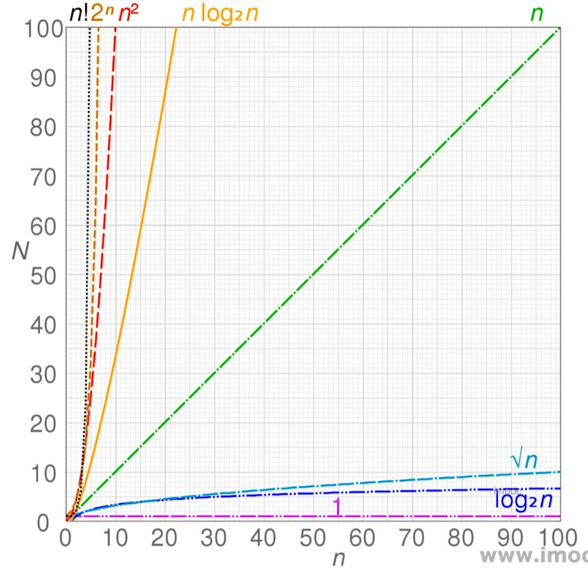

如上图所示，O(1) 为最小时间，O(n!) 为最大时间

以下示例帮忙理解：

- `O(1)` 只运行一次

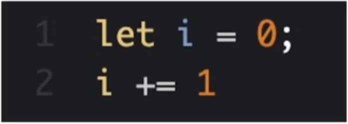

- `O(n)` 运行 n 次，取决于 n 的大小

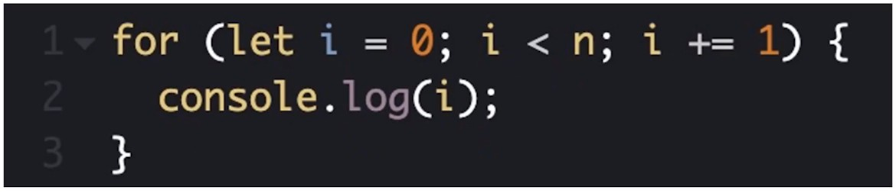

- `O(1) + O(n) = O(n)` n 足够大，那么 1 就可以忽略不计

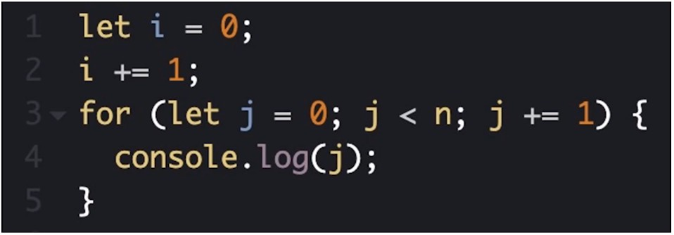

- `O(n) * O(n) = O(n^2)` 这个很好理解吧，就是平方

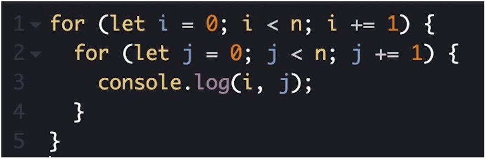

- `O(logN)` logN 就是求 2 的多少次方为 n

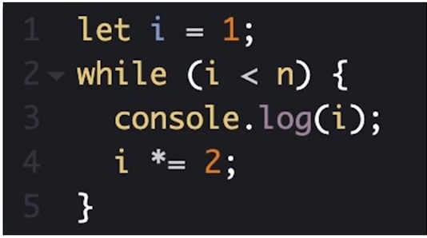

### 空间复杂度

描述程序运行过程中占用存储空间大小的量度，也是用大 O 表示

以下示例帮忙理解：

- `O(1)` 只有一个变量

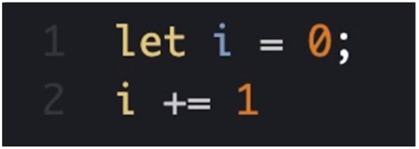

- `O(n)` 数组中有 n 个内存单元

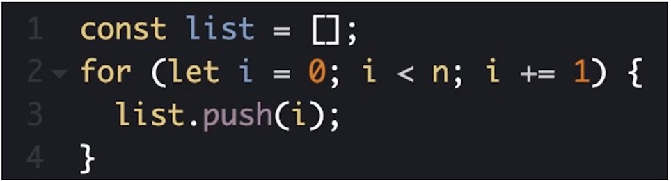

- `O(n^2)` n^2 个内存单元

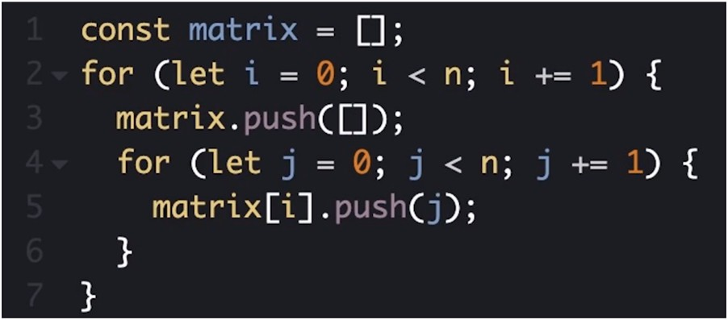

### 数据结构

1. 栈
   - 后进先出的数据结构，js 中没有栈，但可以使用 Array 实现栈的所有功能
   - 什么场景使用栈？
     - 十进制转二进制
       - 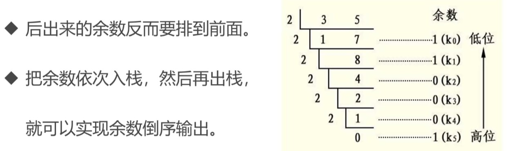
     - 有效的括号
       - 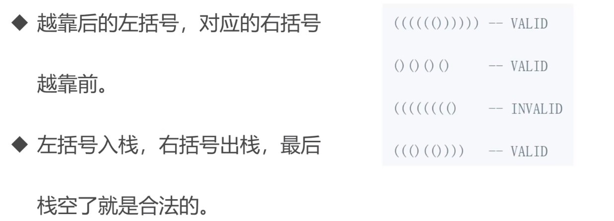
       - 代码：[有效括号.js](./src/数据结构/栈/有效括号.js)
       - 来源：[leetcode 20](https://leetcode.cn/problems/valid-parentheses/description/)
     - 函数调用堆栈
       - 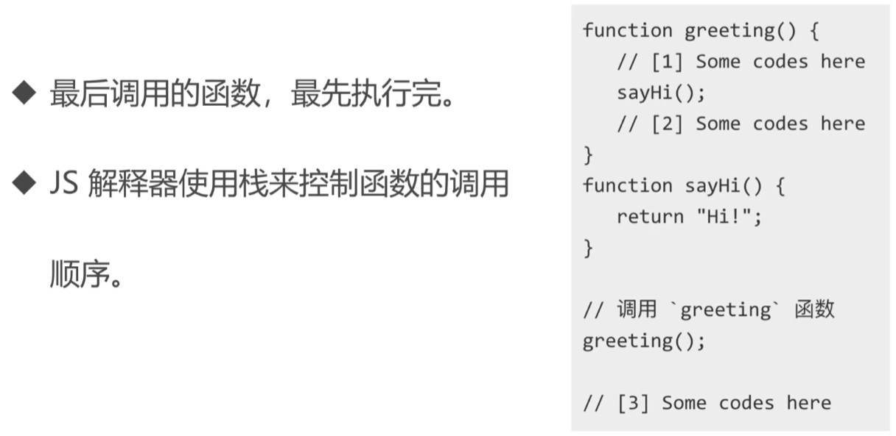
       - 这个可以去看我之前的文章[《深入 js 执行上下文》](https://juejin.cn/post/7206998548343373884)

2. 队列
    - 先进先出的数据结构，js 中没有队列，同样也可以使用 Array 实现队列的所有功能
    - 什么场景使用队列？
      - 食堂排队打饭
      - js 运行的异步队列
      - 最近的请求次数
        - 在某一时刻发起请求，并以当前时刻为基准，统计前 3000ms 一共发送了多少个请求，也就是说要返回一个数字。详细题目请看：[leetcode 933](https://leetcode.cn/problems/number-of-recent-calls/description/) ，当然，题目说的未必有我的清楚
        - 代码：[请求次数.js](./src/数据结构/队列/请求次数.js)

3. 链表
    - 多个元素组成的列表，元素存储不连续，用 next 指针连在一起，在 js 中可以使用 Object 来模拟链表
    - 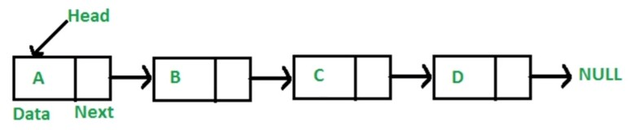
    - 数组和链表有啥区别？
      - 数组：连续的存储结构，增删非首尾元素时，往往需要移动元素
      - 链表：增删非首尾元素不需要移动元素，只需要更改 next 的指向即可
    - 链表数据结构模拟：[模拟链表.js](./src/数据结构/链表/模拟链表.js)
    - 做几道题：
      - 删除链表中的节点：
        - 来源：[leetcode 237](https://leetcode.cn/problems/delete-node-in-a-linked-list/description/)
        - 代码：[删除节点.js](./src/数据结构/链表/删除节点.js)
        - 思路：删除下一个节点
      - 反转链表：
        - 来源：[leetcode 206](https://leetcode.cn/problems/reverse-linked-list/)
        - 代码：[反转链表.js](./src/数据结构/链表/反转链表.js)
        - 思路：使用双指针遍历
      - 两数想加：
        - 来源：[leetcode 2](https://leetcode.cn/problems/add-two-numbers/)
        - 代码：[两数想加.js](./src/数据结构/链表/两数想加.js)
        - 思路：常规加法，注意进位问题
      - 排序链表去重：
        - 来源：[leetcode 83](https://leetcode.cn/problems/remove-duplicates-from-sorted-list/description/)
        - 代码：[排序链表去重.js](./src/数据结构/链表/排序链表去重.js)
        - 思路：遍历去重
      - 判断环形链表：
        - 来源：[leetcode 141](https://leetcode.cn/problems/linked-list-cycle/)
        - 代码：[判断环形链表.js](./src/数据结构/链表/判断环形链表.js)
        - 思路：操场上跑的快的肯定会追上跑得慢的
      - 实现 `instanceOf` 方法：
        - 来源：js 原型链的原理
        - 代码：[myInstanceOf.js](./src/数据结构/链表/myInstanceOf.js)
        - 思路：顺着 A 的 `__proto__` 找，如果和 B.prototype 相等，即为 true
      - 获取 json 节点：
        - 来源：重写获取不定层级值函数
        - 代码：[jsonNode.js](./src/数据结构/链表/jsonNode.js)
        - 思路：利用类似链表遍历的结构
      - 判断回文链表：
        - 来源：[leetcode 234](https://leetcode.cn/problems/palindrome-linked-list/)
        - 代码：[判断回文链表.js](./src/数据结构/链表/判断回文链表.js)
        - 思路：第一想法是转数组对比，但是这种方法太耗时耗内存了，所以改为对链表截断后遍历对比。使用数组的时空复杂度都是 `O(n)`，使用截断遍历对比后的时间复杂度是 `O(n)`，空间复杂度是 `O(1)`，事实上，虽然时间复杂度相同，但实际运行时间也大大缩减了

4. 集合
    - 一种无序且唯一的数据结构，ES6 中有集合，就是 Set
    - 做几道题：
      - 数组交集去重：
        - `return [...new Set(nums1)].filter((n) => nums2.includes(n))`
        - 经典的没话说，需要注意的一点是：对数组先去重再筛选，比先筛选再去重的运行速度要快一些
        - 时间复杂度(TC)：O(mn)，m 是 nums1 的长度，是 filter 的时间，n 是 nums2 的长度，是调用 includes 方法的时间
        - 空间复杂度(SC)：O(m)，m 是 nums1 扩展出的数组长度

5. 字典
    - 以键值对的形式存储唯一值的数据结构，ES6 中的字典，就是 Map
    - 

  

   
